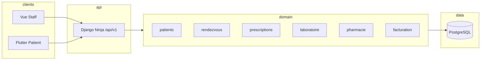

# Dossier d'architecture technique (DAT) — SGHL

## 1. Contexte

Le SGHL est un ERP hospitalier couvrant le parcours patient : admission, soins, prescriptions, laboratoire, pharmacie, facturation, documents PDF et portail patient mobile.

## 2. Stack technique

| Couche | Technologie |
|--------|-------------|
| API | Django 5.2, Django Ninja, JWT (access + refresh) |
| Base | SQLite (dev), PostgreSQL 16 (prod / Docker) |
| Staff web | Vue 3, Vite, Pinia, Axios |
| Patient mobile | Flutter, HTTP + PDF |
| PDF | ReportLab, signature HMAC (`PDF_SIGNING_KEY`) |
| Audit | Journal immuable (`audit` app) |

## 3. Architecture logique

## 4. Sécurité

- Authentification JWT ; refresh tokens stockés hashés (SHA-256).
- Rôles : `admin`, `medecin`, `infirmier`, `biologiste`, `pharmacien`, `comptable`, `patient`.
- CORS : ouvert en `DEBUG`, liste blanche `CORS_ALLOWED_ORIGINS` en production.
- Limite de tentatives de connexion (`LOGIN_RATE_LIMIT_*`) par IP + identifiant.
- Optimistic locking (`version`) sur entités sensibles (RDV, prescriptions, etc.).

## 5. Modules métier (apps Django)

| App | Responsabilité |
|-----|----------------|
| `accounts` | Utilisateurs, rôles, JWT |
| `patients` | Dossiers patients |
| `hospitalisation` | Admissions / sorties |
| `rendezvous` | Planification consultations |
| `prescriptions` | Ordonnances, CIM-10 |
| `laboratoire` | Analyses, résultats |
| `pharmacie` | Stock, dispensation |
| `facturation` | Tarifs, factures, paiements |
| `soins` | Constantes, plans de soins |
| `documents` | Génération PDF |
| `audit` | Traçabilité des actions |

## 6. API principale (`/api/v1/`)

- `POST /auth/login/`, `/auth/refresh/`, `/auth/logout/`, `GET /auth/me/`
- `GET /dashboard/stats/` — KPI tableau de bord staff
- `GET /audit/logs/` — journal (admin)
- CRUD par module : `/patients/`, `/rendez-vous/`, `/prescriptions/`, etc.
- Portail patient : routes sous `/patient/` (Flutter)

## 7. Déploiement recommandé

1. PostgreSQL via `docker compose up -d db`
2. Variables `.env` production (`DEBUG=False`, secrets forts, `CORS_ALLOWED_ORIGINS`)
3. `python manage.py setup_project --skip-seed` puis seeds contrôlés
4. Backend derrière reverse proxy (HTTPS)
5. Frontend : `npm run build` servi en statique ou intégré au proxy

## 8. Modèle de données & API

| Document | Contenu |
|----------|---------|
| [MCD.md](MCD.md) | Modèle conceptuel (entités, cardinalités) |
| [MLD.md](MLD.md) | Modèle logique PostgreSQL (tables, types, contraintes) |
| [API.md](API.md) | Dictionnaire des endpoints `/api/v1/` |
| [openapi.json](openapi.json) | Spécification OpenAPI 3.1 (générée) |

## 9. Évolutions prévues (hors MVP)

- MFA, notifications push, interop HL7/FHIR
- Pipeline CI/CD déploiement (artefacts Docker)
- Vue calendrier RDV enrichie (drag & drop)
