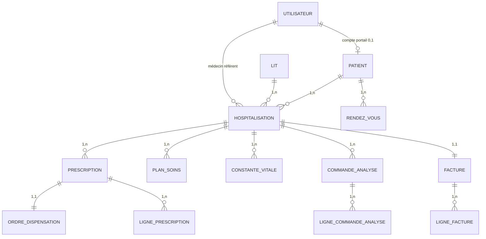
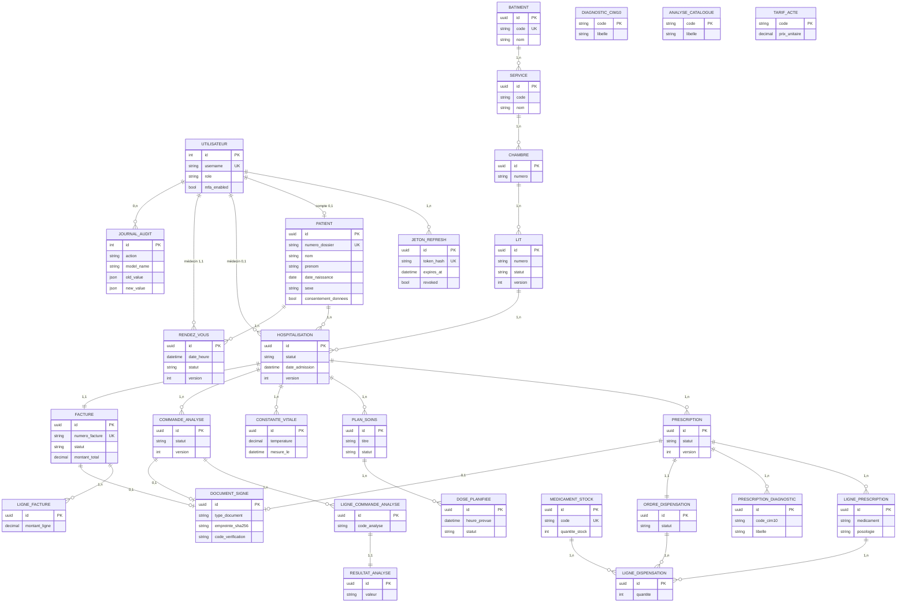

# Modèle conceptuel de données (MCD) — SGHL

Document de référence pour la soutenance. Il décrit les **entités**, **attributs** et **associations** du système tel qu’implémenté dans Django (PostgreSQL / SQLite).

Voir aussi : [DAT.md](DAT.md) (architecture), [README.md](../README.md) (installation).

---

## 1. Conventions

| Symbole | Signification |
|---------|----------------|
| `(1,1)` | Obligatoire et unique |
| `(0,1)` | Optionnel, au plus un |
| `(1,n)` | Obligatoire, plusieurs possibles |
| `(0,n)` | Optionnel, plusieurs possibles |
| **PK** | Identifiant principal |
| **FK** | Clé étrangère |
| `version` | Verrouillage optimiste (concurrence) |

**Traits transverses** (non stockés comme tables) :

- **TimeStamped** : `created_at`, `updated_at` sur la plupart des entités métier.
- **OptimisticLock** : champ `version` sur les entités modifiables en concurrence (lit, hospitalisation, prescription, RDV, facture, etc.).

---

## 2. Vue d’ensemble — parcours patient

Le **patient** est l’entité centrale. Une **hospitalisation active** regroupe prescriptions, soins, laboratoire et facturation. Les **rendez-vous** et le **compte portail** sont liés directement au patient.



---

## 3. Diagramme MCD global



---

## 4. Dictionnaire des entités

### 4.1 Sécurité et accès

#### UTILISATEUR (`accounts.User`)

| Attribut | Type | Contrainte |
|----------|------|------------|
| id | entier | PK |
| username | texte | unique |
| email, first_name, last_name | texte | — |
| role | énumération | admin, medecin, infirmier, biologiste, pharmacien, comptable, patient |
| mfa_enabled | booléen | défaut false |
| is_active | booléen | — |

**Associations :**

| Association | Vers | Cardinalité |
|-------------|------|-------------|
| possède | JETON_REFRESH | (1,n) |
| est lié à | PATIENT (compte portail) | (0,1) |
| intervient sur | HOSPITALISATION, RENDEZ_VOUS, PRESCRIPTION, etc. | selon rôle |
| trace | JOURNAL_AUDIT | (0,n) |

#### JETON_REFRESH (`accounts.RefreshToken`)

| Attribut | Type | Contrainte |
|----------|------|------------|
| id | UUID | PK |
| token_hash | texte | unique |
| expires_at, revoked | — | rotation JWT |

---

### 4.2 Patients

#### PATIENT (`patients.Patient`)

| Attribut | Type | Contrainte |
|----------|------|------------|
| id | UUID | PK |
| numero_dossier | texte | unique |
| nom, prenom | texte | — |
| date_naissance | date | — |
| sexe | M / F / A | — |
| telephone, email, adresse | texte | optionnels |
| consentement_donnees | booléen | RGPD |
| version | entier | verrou optimiste |

**Associations :**

| Association | Vers | Cardinalité |
|-------------|------|-------------|
| a pour compte | UTILISATEUR | (0,1) |
| est hospitalisé | HOSPITALISATION | (0,n) |
| prend | RENDEZ_VOUS | (0,n) |

---

### 4.3 Logistique hospitalière

#### BATIMENT → SERVICE → CHAMBRE → LIT

Hiérarchie physique : **Bâtiment (1,n) Service (1,n) Chambre (1,n) Lit**.

| Entité | Attributs clés |
|--------|----------------|
| BATIMENT | code (UK), nom, actif |
| SERVICE | code (unique par bâtiment), nom |
| CHAMBRE | numero (unique par service) |
| LIT | numero, statut (libre / occupé / maintenance), version |

**Règle métier :** un lit en statut *occupé* correspond à une hospitalisation *active* sur ce lit.

---

### 4.4 Hospitalisation (hub clinique)

#### HOSPITALISATION (`hospitalisation.Hospitalisation`)

| Attribut | Type | Contrainte |
|----------|------|------------|
| id | UUID | PK |
| motif_admission | texte | — |
| date_admission | datetime | — |
| date_sortie_prevue / effective | date/datetime | optionnels |
| statut | énumération | active, sortie, annulee |
| version | entier | — |

**Associations :**

| Association | Vers | Cardinalité |
|-------------|------|-------------|
| concerne | PATIENT | (1,1) |
| occupe | LIT | (1,1) |
| est suivie par | UTILISATEUR (médecin référent) | (0,1) |
| génère | PRESCRIPTION, PLAN_SOINS, CONSTANTE_VITALE, COMMANDE_ANALYSE | (1,n) |
| facturée par | FACTURE | (1,1) |

**Contraintes d’intégrité :**

- Au plus **une** hospitalisation *active* par patient.
- Au plus **une** hospitalisation *active* par lit.

---

### 4.5 Rendez-vous

#### RENDEZ_VOUS (`rendezvous.RendezVous`)

| Attribut | Type | Contrainte |
|----------|------|------------|
| date_heure | datetime | index |
| duree_minutes | entier | défaut 30 |
| motif | texte | — |
| statut | planifie, confirme, annule, termine, absent | — |
| notes, motif_annulation | texte | — |
| confirme_le, annule_le | datetime | — |

**Associations :** PATIENT (1,1), UTILISATEUR médecin (1,1), créateur / annulateur (0,1).

**Règle métier :** pas de chevauchement de créneaux pour un même médecin (contrôle applicatif).

---

### 4.6 Prescriptions

#### PRESCRIPTION

| Attribut | Type |
|----------|------|
| statut | brouillon, validee, annulee |
| observations | texte |
| validee_le, validee_par | — |

#### LIGNE_PRESCRIPTION

| Attribut | Type |
|----------|------|
| medicament, posologie, duree_traitement | texte |
| voie_administration | texte |
| ordre | entier |

#### PRESCRIPTION_DIAGNOSTIC (table associative)

Copie dénormalisée du code CIM-10 au moment de la prescription (`code_cim10`, `libelle`).

#### DIAGNOSTIC_CIM10 (référentiel)

Catalogue des codes CIM-10 (`code` UK, `libelle`).

**Associations :**

```
HOSPITALISATION (1,n) — PRESCRIPTION (1,n) — LIGNE_PRESCRIPTION
PRESCRIPTION (1,n) — PRESCRIPTION_DIAGNOSTIC
PRESCRIPTION (1,1) — ORDRE_DISPENSATION (pharmacie)
```

---

### 4.7 Soins infirmiers

| Entité | Rôle |
|--------|------|
| PLAN_SOINS | Plan lié à une hospitalisation (titre, description, statut actif/termine/annule) |
| CONSTANTE_VITALE | Mesures (TA, FC, température, SpO₂, glycémie…) + infirmier |
| INTERVENTION_INFIRMIERE | Acte réalisé, lien optionnel vers PLAN_SOINS |
| DOSE_PLANIFIEE | Dose médicamenteuse planifiée / administrée / omise |

**Associations :** toutes rattachées à **HOSPITALISATION** ; DOSE_PLANIFIEE → PLAN_SOINS (1,n).

---

### 4.8 Laboratoire (LIS)

| Entité | Rôle |
|--------|------|
| ANALYSE_CATALOGUE | Référentiel des analyses (code UK) |
| COMMANDE_ANALYSE | Workflow : commandee → prelevee → affectee → resultats_saisis → validee → publiee |
| LIGNE_COMMANDE_ANALYSE | Analyses demandées (copie catalogue) |
| RESULTAT_ANALYSE | (1,1) avec LIGNE_COMMANDE_ANALYSE — valeur, unité, saisi_par |

**Associations :** COMMANDE_ANALYSE → HOSPITALISATION (1,1), médecin (1,1), biologistes aux étapes (0,1).

---

### 4.9 Pharmacie

| Entité | Rôle |
|--------|------|
| MEDICAMENT_STOCK | Stock (code UK, quantite_stock, seuil_alerte) |
| ORDRE_DISPENSATION | (1,1) avec PRESCRIPTION validée |
| LIGNE_DISPENSATION | Lie LIGNE_PRESCRIPTION + MEDICAMENT_STOCK + quantité |

**Workflow :** en_attente → prepare → dispense (décrément stock).

---

### 4.10 Facturation

| Entité | Rôle |
|--------|------|
| TARIF_ACTE | Grille tarifaire (code UK, categorie, prix_unitaire) |
| FACTURE | (1,1) avec HOSPITALISATION — brouillon → validee → payee |
| LIGNE_FACTURE | Actes facturés (source : auto_sejour, auto_labo, auto_pharma, manuelle) |

**Règle métier :** une seule facture par hospitalisation ; numéro de facture attribué à la validation.

---

### 4.11 Documents PDF signés

#### DOCUMENT_SIGNE (`documents.DocumentSigne`)

| Attribut | Type |
|----------|------|
| type_document | facture, compte_rendu_labo, ordonnance |
| fichier | fichier PDF |
| empreinte_sha256, signature | intégrité |
| code_verification | contrôle public |
| signe_par, signe_le, signataire_nom, signataire_role | — |

**Associations (exclusives, 0,1) :** FACTURE **ou** COMMANDE_ANALYSE **ou** PRESCRIPTION.

---

### 4.12 Audit

#### JOURNAL_AUDIT (`audit.AuditLog`)

| Attribut | Type |
|----------|------|
| action | CREATE, UPDATE, DELETE |
| model_name, object_id | cible |
| old_value, new_value | JSON |
| ip_address, timestamp | traçabilité |

Association : UTILISATEUR (0,1) — journal **append-only** (pas de modification).

---

## 5. Matrice des cardinalités (résumé)

| Entité A | Association | Entité B | Card. A → B | Card. B → A |
|----------|-------------|----------|-------------|-------------|
| BATIMENT | contient | SERVICE | (1,1) | (1,n) |
| SERVICE | contient | CHAMBRE | (1,1) | (1,n) |
| CHAMBRE | contient | LIT | (1,1) | (1,n) |
| PATIENT | subit | HOSPITALISATION | (1,1) | (0,n) |
| LIT | accueille | HOSPITALISATION | (1,1) | (0,n) |
| HOSPITALISATION | porte | PRESCRIPTION | (1,1) | (0,n) |
| PRESCRIPTION | détaille | LIGNE_PRESCRIPTION | (1,1) | (1,n) |
| PRESCRIPTION | déclenche | ORDRE_DISPENSATION | (1,1) | (1,1) |
| HOSPITALISATION | commande | COMMANDE_ANALYSE | (1,1) | (0,n) |
| LIGNE_COMMANDE | produit | RESULTAT_ANALYSE | (1,1) | (1,1) |
| HOSPITALISATION | génère | FACTURE | (1,1) | (1,1) |
| PATIENT | planifie | RENDEZ_VOUS | (1,1) | (0,n) |
| PATIENT | possède | UTILISATEUR (portail) | (0,1) | (0,1) |

---

## 6. Correspondance MCD → implémentation Django

| Entité MCD | Table Django | App |
|------------|--------------|-----|
| UTILISATEUR | `accounts_user` | accounts |
| JETON_REFRESH | `accounts_refreshtoken` | accounts |
| PATIENT | `patients_patient` | patients |
| BATIMENT … LIT | `logistics_*` | logistics |
| HOSPITALISATION | `hospitalisation_hospitalisation` | hospitalisation |
| RENDEZ_VOUS | `rendezvous_rendezvous` | rendezvous |
| PRESCRIPTION | `prescriptions_prescription` | prescriptions |
| PLAN_SOINS … DOSE | `soins_*` | soins |
| COMMANDE_ANALYSE | `laboratoire_*` | laboratoire |
| ORDRE_DISPENSATION | `pharmacie_*` | pharmacie |
| FACTURE | `facturation_*` | facturation |
| DOCUMENT_SIGNE | `documents_documentsigne` | documents |
| JOURNAL_AUDIT | `audit_auditlog` | audit |

Générer le schéma physique à jour :

```powershell
.\.venv\Scripts\python.exe manage.py graph_models -a -o docs/mld.png
```

*(nécessite `django-extensions` + Graphviz, optionnel.)*

---

## 7. Règles métier transverses

1. **Hospitalisation active** : pivot pour prescription, soins, labo et facture.
2. **Verrouillage optimiste** : toute mise à jour concurrente exige `version` à jour (HTTP 409).
3. **Prescription validée** : non modifiable ; déclenche ordre de dispensation.
4. **Commande labo publiée** : résultats visibles patient ; PDF signé possible.
5. **Facture payée** : lignes figées ; paiement tracé (`mode_paiement`, `reference_paiement`).
6. **Consentement patient** : obligatoire à la création du dossier (`consentement_donnees`).
7. **Audit** : actions sensibles (login, CRUD métier) journalisées avec IP.

---

## 8. Évolutions MCD envisagées

| Besoin | Impact MCD |
|--------|------------|
| MFA | Attribut `mfa_enabled` déjà sur UTILISATEUR ; ajout secret TOTP |
| Multi-établissement | FK `etablissement_id` sur BATIMENT, PATIENT |
| File d’attente RDV | Entité FILE_ATTENTE entre PATIENT et SERVICE |
| Paiement en ligne | Entité TRANSACTION liée à FACTURE |
| HL7 / FHIR | Entité MESSAGE_INTEROP (externe, non relationnelle au cœur) |

---

*Document aligné sur le code source SGHL — juin 2026. Schéma physique : [MLD.md](MLD.md).*
