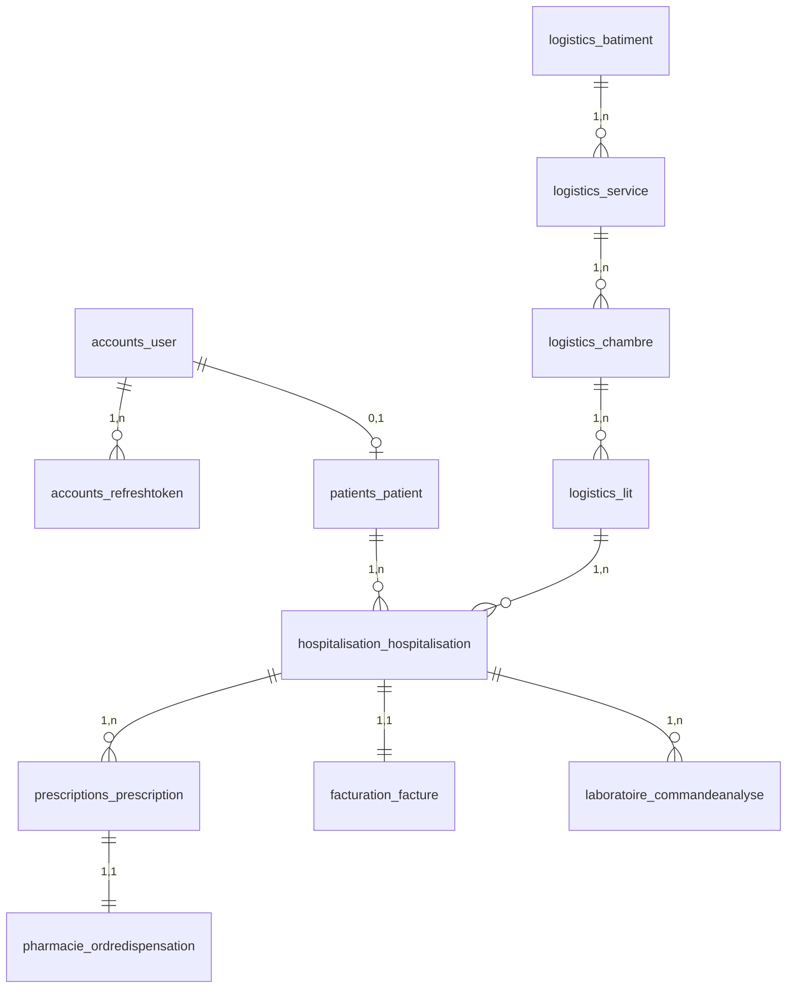

# Modèle logique de données (MLD) — SGHL

Modèle logique **PostgreSQL 16** dérivé du [MCD](MCD.md) et des modèles Django. Cible de production du cahier des charges (ACID, indexation, verrouillage optimiste).

---

## 1. Conventions PostgreSQL

| Règle | Choix SGHL |
|-------|------------|
| Identifiants métier | `UUID` (PK patients, hospitalisations, etc.) |
| Identifiants utilisateurs | `BIGSERIAL` (`accounts_user.id`) |
| Horodatage | `TIMESTAMPTZ` (`USE_TZ=True`) |
| Texte court | `VARCHAR(n)` |
| Texte long | `TEXT` |
| Montants | `NUMERIC(14,2)` ou `NUMERIC(12,2)` |
| JSON audit | `JSONB` |
| Suppression référentielle | `ON DELETE PROTECT` (données médicales) ou `CASCADE` (lignes détail) |
| Concurrence | Colonne `version INTEGER NOT NULL DEFAULT 1` |

---

## 2. Schéma relationnel (vue d’ensemble)



---

## 3. Tables — Sécurité & patients

### `accounts_user`

Hérite des champs Django `AbstractUser`.

| Colonne | Type PostgreSQL | Contraintes |
|---------|-----------------|-------------|
| id | BIGSERIAL | PK |
| username | VARCHAR(150) | UNIQUE, NOT NULL |
| password | VARCHAR(128) | NOT NULL |
| email | VARCHAR(254) | |
| first_name, last_name | VARCHAR(150) | |
| role | VARCHAR(20) | NOT NULL, défaut `infirmier` |
| mfa_enabled | BOOLEAN | NOT NULL, défaut FALSE |
| is_active, is_staff, is_superuser | BOOLEAN | |
| date_joined | TIMESTAMPTZ | |
| last_login | TIMESTAMPTZ | NULL |

**Valeurs `role` :** `admin`, `medecin`, `infirmier`, `biologiste`, `pharmacien`, `comptable`, `patient`.

### `accounts_refreshtoken`

| Colonne | Type | Contraintes |
|---------|------|-------------|
| id | UUID | PK |
| user_id | BIGINT | FK → accounts_user, ON DELETE CASCADE |
| token_hash | VARCHAR(128) | UNIQUE, NOT NULL |
| created_at | TIMESTAMPTZ | NOT NULL |
| expires_at | TIMESTAMPTZ | NOT NULL |
| revoked | BOOLEAN | NOT NULL, défaut FALSE |

**Index :** `user_id`, tri `-created_at`.

### `patients_patient`

| Colonne | Type | Contraintes |
|---------|------|-------------|
| id | UUID | PK |
| numero_dossier | VARCHAR(20) | UNIQUE, NOT NULL |
| nom, prenom | VARCHAR(100) | NOT NULL |
| date_naissance | DATE | NOT NULL |
| sexe | VARCHAR(1) | NOT NULL (`M`,`F`,`A`) |
| telephone | VARCHAR(20) | |
| email | VARCHAR(254) | |
| adresse | TEXT | |
| consentement_donnees | BOOLEAN | NOT NULL |
| compte_utilisateur_id | BIGINT | FK → accounts_user, UNIQUE, NULL, ON DELETE SET NULL |
| version | INTEGER | NOT NULL, défaut 1 |
| created_at, updated_at | TIMESTAMPTZ | NOT NULL |

**Index :** `(numero_dossier)`, `(nom, prenom)`.

### `audit_auditlog`

| Colonne | Type | Contraintes |
|---------|------|-------------|
| id | BIGSERIAL | PK |
| user_id | BIGINT | FK → accounts_user, NULL, ON DELETE SET NULL |
| action | VARCHAR(10) | `CREATE`, `UPDATE`, `DELETE` |
| model_name | VARCHAR(100) | NOT NULL |
| object_id | VARCHAR(64) | NOT NULL |
| old_value, new_value | JSONB | NULL |
| ip_address | INET | NULL |
| timestamp | TIMESTAMPTZ | NOT NULL, auto |

**Index :** `(model_name, object_id)`, `(timestamp DESC)`.

---

## 4. Tables — Logistique

### `logistics_batiment`

| Colonne | Type | Contraintes |
|---------|------|-------------|
| id | UUID | PK |
| code | VARCHAR(20) | UNIQUE, NOT NULL |
| nom | VARCHAR(150) | NOT NULL |
| actif | BOOLEAN | NOT NULL |
| created_at, updated_at | TIMESTAMPTZ | |

### `logistics_service`

| Colonne | Type | Contraintes |
|---------|------|-------------|
| id | UUID | PK |
| batiment_id | UUID | FK → logistics_batiment, PROTECT |
| code | VARCHAR(20) | NOT NULL |
| nom | VARCHAR(150) | NOT NULL |
| actif | BOOLEAN | NOT NULL |
| created_at, updated_at | TIMESTAMPTZ | |

**UNIQUE :** `(batiment_id, code)`.

### `logistics_chambre`

| Colonne | Type | Contraintes |
|---------|------|-------------|
| id | UUID | PK |
| service_id | UUID | FK → logistics_service, PROTECT |
| numero | VARCHAR(20) | NOT NULL |
| actif | BOOLEAN | NOT NULL |
| created_at, updated_at | TIMESTAMPTZ | |

**UNIQUE :** `(service_id, numero)`.

### `logistics_lit`

| Colonne | Type | Contraintes |
|---------|------|-------------|
| id | UUID | PK |
| chambre_id | UUID | FK → logistics_chambre, PROTECT |
| numero | VARCHAR(10) | NOT NULL |
| statut | VARCHAR(20) | `libre`, `occupe`, `maintenance` |
| actif | BOOLEAN | NOT NULL |
| version | INTEGER | NOT NULL |
| created_at, updated_at | TIMESTAMPTZ | |

**UNIQUE :** `(chambre_id, numero)`. **Index :** `(statut)`.

---

## 5. Tables — Hospitalisation (pivot clinique)

### `hospitalisation_hospitalisation`

| Colonne | Type | Contraintes |
|---------|------|-------------|
| id | UUID | PK |
| patient_id | UUID | FK → patients_patient, PROTECT |
| lit_id | UUID | FK → logistics_lit, PROTECT |
| medecin_referent_id | BIGINT | FK → accounts_user, SET NULL |
| motif_admission | TEXT | NOT NULL |
| date_admission | TIMESTAMPTZ | NOT NULL |
| date_sortie_prevue | DATE | NULL |
| date_sortie_effective | TIMESTAMPTZ | NULL |
| statut | VARCHAR(20) | `active`, `sortie`, `annulee` |
| version | INTEGER | NOT NULL |
| created_at, updated_at | TIMESTAMPTZ | |

**Index :** `(statut)`, `(date_admission)`.

**Contraintes UNIQUE partielles (PostgreSQL) :**

```sql
-- Une seule hospitalisation active par patient
CREATE UNIQUE INDEX unique_hospitalisation_active_par_patient
  ON hospitalisation_hospitalisation (patient_id)
  WHERE statut = 'active';

-- Un seul patient actif par lit
CREATE UNIQUE INDEX unique_hospitalisation_active_par_lit
  ON hospitalisation_hospitalisation (lit_id)
  WHERE statut = 'active';
```

---

## 6. Tables — Rendez-vous

### `rendezvous_rendezvous`

| Colonne | Type | Contraintes |
|---------|------|-------------|
| id | UUID | PK |
| patient_id | UUID | FK → patients_patient, PROTECT |
| medecin_id | BIGINT | FK → accounts_user, PROTECT |
| date_heure | TIMESTAMPTZ | NOT NULL |
| duree_minutes | SMALLINT | NOT NULL, défaut 30 |
| motif | VARCHAR(255) | NOT NULL |
| statut | VARCHAR(20) | NOT NULL |
| notes | TEXT | |
| cree_par_id, annule_par_id | BIGINT | FK, SET NULL |
| confirme_le, annule_le | TIMESTAMPTZ | NULL |
| motif_annulation | VARCHAR(255) | |
| version | INTEGER | NOT NULL |
| created_at, updated_at | TIMESTAMPTZ | |

**Index :** `(date_heure)`, `(statut)`, `(medecin_id, date_heure)`.

---

## 7. Tables — Prescriptions

### `prescriptions_diagnosticcim10` (référentiel)

| Colonne | Type | Contraintes |
|---------|------|-------------|
| id | BIGSERIAL | PK |
| code | VARCHAR(10) | UNIQUE |
| libelle | VARCHAR(255) | NOT NULL |
| actif | BOOLEAN | NOT NULL |

### `prescriptions_prescription`

| Colonne | Type | Contraintes |
|---------|------|-------------|
| id | UUID | PK |
| hospitalisation_id | UUID | FK, PROTECT |
| medecin_id | BIGINT | FK → accounts_user, PROTECT |
| statut | VARCHAR(20) | `brouillon`, `validee`, `annulee` |
| observations | TEXT | |
| validee_le | TIMESTAMPTZ | NULL |
| validee_par_id | BIGINT | FK, SET NULL |
| version | INTEGER | NOT NULL |
| created_at, updated_at | TIMESTAMPTZ | |

**Index :** `(statut)`, `(created_at)`.

### `prescriptions_prescriptiondiagnostic`

| Colonne | Type | Contraintes |
|---------|------|-------------|
| id | UUID | PK |
| prescription_id | UUID | FK, CASCADE |
| code_cim10 | VARCHAR(10) | NOT NULL |
| libelle | VARCHAR(255) | NOT NULL |

**UNIQUE :** `(prescription_id, code_cim10)`.

### `prescriptions_ligneprescription`

| Colonne | Type | Contraintes |
|---------|------|-------------|
| id | UUID | PK |
| prescription_id | UUID | FK, CASCADE |
| medicament | VARCHAR(200) | NOT NULL |
| posologie | VARCHAR(150) | NOT NULL |
| duree_traitement | VARCHAR(100) | |
| voie_administration | VARCHAR(50) | défaut `orale` |
| instructions | TEXT | |
| ordre | SMALLINT | NOT NULL |

---

## 8. Tables — Soins infirmiers

### `soins_plansoins`

| Colonne | Type | Contraintes |
|---------|------|-------------|
| id | UUID | PK |
| hospitalisation_id | UUID | FK, PROTECT |
| titre | VARCHAR(200) | NOT NULL |
| description | TEXT | NOT NULL |
| date_debut | TIMESTAMPTZ | NOT NULL |
| date_fin | TIMESTAMPTZ | NULL |
| statut | VARCHAR(20) | `actif`, `termine`, `annule` |
| cree_par_id | BIGINT | FK, SET NULL |
| version | INTEGER | NOT NULL |
| created_at, updated_at | TIMESTAMPTZ | |

### `soins_constantevitale`

| Colonne | Type | Contraintes |
|---------|------|-------------|
| id | UUID | PK |
| hospitalisation_id | UUID | FK, PROTECT |
| temperature | NUMERIC(4,1) | NULL |
| tension_systolique, tension_diastolique | SMALLINT | NULL |
| frequence_cardiaque, frequence_respiratoire | SMALLINT | NULL |
| saturation_o2 | SMALLINT | NULL |
| glycemie | NUMERIC(5,2) | NULL |
| mesure_le | TIMESTAMPTZ | NOT NULL |
| infirmier_id | BIGINT | FK, SET NULL |
| notes | TEXT | |
| created_at, updated_at | TIMESTAMPTZ | |

**Index :** `(mesure_le)`.

### `soins_interventioninfirmiere`

| Colonne | Type | Contraintes |
|---------|------|-------------|
| id | UUID | PK |
| hospitalisation_id | UUID | FK, PROTECT |
| plan_soins_id | UUID | FK → soins_plansoins, SET NULL |
| type_intervention | VARCHAR(100) | NOT NULL |
| description | TEXT | NOT NULL |
| realisee_le | TIMESTAMPTZ | NOT NULL |
| infirmier_id | BIGINT | FK, SET NULL |
| created_at, updated_at | TIMESTAMPTZ | |

### `soins_doseplanifiee`

| Colonne | Type | Contraintes |
|---------|------|-------------|
| id | UUID | PK |
| plan_soins_id | UUID | FK, PROTECT |
| medicament | VARCHAR(200) | NOT NULL |
| posologie | VARCHAR(100) | NOT NULL |
| heure_prevue | TIMESTAMPTZ | NOT NULL |
| statut | VARCHAR(20) | `planifiee`, `administree`, `omise` |
| administree_le | TIMESTAMPTZ | NULL |
| infirmier_id | BIGINT | FK, SET NULL |
| version | INTEGER | NOT NULL |
| created_at, updated_at | TIMESTAMPTZ | |

**Index :** `(heure_prevue)`, `(statut)`.

---

## 9. Tables — Laboratoire (LIS)

### `laboratoire_analysescatalogue`

| Colonne | Type | Contraintes |
|---------|------|-------------|
| id | BIGSERIAL | PK |
| code | VARCHAR(20) | UNIQUE |
| libelle | VARCHAR(255) | NOT NULL |
| unite_reference | VARCHAR(50) | |
| valeur_reference | VARCHAR(100) | |
| actif | BOOLEAN | NOT NULL |

### `laboratoire_commandeanalyse`

| Colonne | Type | Contraintes |
|---------|------|-------------|
| id | UUID | PK |
| hospitalisation_id | UUID | FK, PROTECT |
| medecin_id | BIGINT | FK, PROTECT |
| statut | VARCHAR(20) | workflow LIS |
| observations | TEXT | |
| preleve_le | TIMESTAMPTZ | NULL |
| preleve_par_id | BIGINT | FK, SET NULL |
| type_echantillon, reference_echantillon | VARCHAR(100) | |
| affectee_le | TIMESTAMPTZ | NULL |
| affectee_a_id, affectee_par_id | BIGINT | FK, SET NULL |
| validee_le | TIMESTAMPTZ | NULL |
| validee_par_id | BIGINT | FK, SET NULL |
| publiee_le | TIMESTAMPTZ | NULL |
| publiee_par_id | BIGINT | FK, SET NULL |
| version | INTEGER | NOT NULL |
| created_at, updated_at | TIMESTAMPTZ | |

**Index :** `(statut)`, `(created_at)`.

### `laboratoire_lignecommandeanalyse`

| Colonne | Type | Contraintes |
|---------|------|-------------|
| id | UUID | PK |
| commande_id | UUID | FK, CASCADE |
| code_analyse | VARCHAR(20) | NOT NULL |
| libelle | VARCHAR(255) | NOT NULL |
| unite_reference, valeur_reference | VARCHAR | |

**UNIQUE :** `(commande_id, code_analyse)`.

### `laboratoire_resultatanalyse`

| Colonne | Type | Contraintes |
|---------|------|-------------|
| id | UUID | PK |
| ligne_id | UUID | FK → lignecommandeanalyse, CASCADE, **UNIQUE** |
| valeur | VARCHAR(100) | NOT NULL |
| unite | VARCHAR(50) | |
| commentaire | TEXT | |
| saisi_par_id | BIGINT | FK, PROTECT |
| created_at, updated_at | TIMESTAMPTZ | |

---

## 10. Tables — Pharmacie

### `pharmacie_medicamentstock`

| Colonne | Type | Contraintes |
|---------|------|-------------|
| id | UUID | PK |
| code | VARCHAR(30) | UNIQUE |
| libelle | VARCHAR(200) | NOT NULL |
| forme | VARCHAR(80) | |
| quantite_stock | INTEGER | NOT NULL, ≥ 0 |
| unite | VARCHAR(30) | défaut `unité` |
| seuil_alerte | INTEGER | NOT NULL |
| actif | BOOLEAN | NOT NULL |
| created_at, updated_at | TIMESTAMPTZ | |

### `pharmacie_ordredispensation`

| Colonne | Type | Contraintes |
|---------|------|-------------|
| id | UUID | PK |
| prescription_id | UUID | FK → prescriptions_prescription, PROTECT, **UNIQUE** |
| statut | VARCHAR(20) | `en_attente`, `prepare`, `dispense`, `annule` |
| pharmacien_id | BIGINT | FK, SET NULL |
| prepare_le, dispense_le | TIMESTAMPTZ | NULL |
| notes | TEXT | |
| version | INTEGER | NOT NULL |
| created_at, updated_at | TIMESTAMPTZ | |

**Index :** `(statut)`.

### `pharmacie_lignedispensation`

| Colonne | Type | Contraintes |
|---------|------|-------------|
| id | UUID | PK |
| ordre_id | UUID | FK, CASCADE |
| ligne_prescription_id | UUID | FK, PROTECT |
| medicament_stock_id | UUID | FK, PROTECT |
| quantite | INTEGER | NOT NULL |

**UNIQUE :** `(ordre_id, ligne_prescription_id)`.

---

## 11. Tables — Facturation

### `facturation_tarifacte`

| Colonne | Type | Contraintes |
|---------|------|-------------|
| id | BIGSERIAL | PK |
| code | VARCHAR(30) | UNIQUE |
| libelle | VARCHAR(255) | NOT NULL |
| categorie | VARCHAR(20) | `sejour`, `laboratoire`, `pharmacie`, `soins`, `divers` |
| prix_unitaire | NUMERIC(12,2) | NOT NULL |
| actif | BOOLEAN | NOT NULL |

### `facturation_facture`

| Colonne | Type | Contraintes |
|---------|------|-------------|
| id | UUID | PK |
| hospitalisation_id | UUID | FK, PROTECT, **UNIQUE** |
| numero_facture | VARCHAR(30) | UNIQUE, NULL |
| statut | VARCHAR(20) | `brouillon`, `validee`, `payee`, `annulee` |
| montant_total | NUMERIC(14,2) | NOT NULL |
| validee_le | TIMESTAMPTZ | NULL |
| validee_par_id | BIGINT | FK, SET NULL |
| payee_le | TIMESTAMPTZ | NULL |
| enregistree_par_id | BIGINT | FK, SET NULL |
| mode_paiement | VARCHAR(50) | |
| reference_paiement | VARCHAR(100) | |
| notes | TEXT | |
| version | INTEGER | NOT NULL |
| created_at, updated_at | TIMESTAMPTZ | |

**Index :** `(statut)`.

### `facturation_lignefacture`

| Colonne | Type | Contraintes |
|---------|------|-------------|
| id | UUID | PK |
| facture_id | UUID | FK, CASCADE |
| code_acte | VARCHAR(30) | NOT NULL |
| libelle | VARCHAR(255) | NOT NULL |
| quantite | INTEGER | NOT NULL |
| prix_unitaire | NUMERIC(12,2) | NOT NULL |
| montant_ligne | NUMERIC(14,2) | NOT NULL |
| source | VARCHAR(20) | `auto_sejour`, `auto_labo`, `auto_pharma`, `manuelle` |

---

## 12. Tables — Documents PDF

### `documents_documentsigne`

| Colonne | Type | Contraintes |
|---------|------|-------------|
| id | UUID | PK |
| type_document | VARCHAR(30) | `facture`, `compte_rendu_labo`, `ordonnance` |
| facture_id | UUID | FK, PROTECT, UNIQUE, NULL |
| commande_analyse_id | UUID | FK, PROTECT, UNIQUE, NULL |
| prescription_id | UUID | FK, PROTECT, UNIQUE, NULL |
| fichier | VARCHAR(100) | chemin stockage |
| empreinte_sha256 | VARCHAR(64) | NOT NULL |
| signature | VARCHAR(64) | NOT NULL |
| code_verification | VARCHAR(12) | NOT NULL |
| signe_par_id | BIGINT | FK, PROTECT |
| signe_le | TIMESTAMPTZ | NOT NULL |
| signataire_nom | VARCHAR(200) | NOT NULL |
| signataire_role | VARCHAR(50) | NOT NULL |
| numero_reference | VARCHAR(50) | |
| created_at, updated_at | TIMESTAMPTZ | |

**Index :** `(type_document)`, `(code_verification)`.

**Règle :** une seule FK métier non NULL par ligne (facture **ou** commande **ou** prescription).

---

## 13. Synthèse des contraintes CDC

| Exigence CDC | Implémentation MLD |
|--------------|-------------------|
| PostgreSQL ACID | Transactions Django + `select_for_update` à l’admission |
| 1 lit = 1 patient actif | Index unique partiel sur `lit_id` WHERE `statut='active'` |
| 1 hospitalisation active / patient | Index unique partiel sur `patient_id` |
| Verrouillage optimiste | `version` sur lit, hospitalisation, prescription, RDV, facture, doses, commandes labo, ordres pharma |
| Audit immuable | `audit_auditlog` append-only, JSONB old/new |
| Prescription verrouillée | `statut='validee'` + ordre dispensation 1:1 |
| Résultats labo immuables | `statut IN ('validee','publiee')` côté applicatif |

---

## 14. Génération et maintenance

```powershell
# Appliquer le MLD (migrations Django)
.\.venv\Scripts\python.exe manage.py migrate

# Inspecter le schéma réel (PostgreSQL)
.\.venv\Scripts\python.exe manage.py dbshell
# \dt
# \d hospitalisation_hospitalisation
```

Le MLD reste **synchronisé** avec le code via les migrations Django (`*/migrations/*.py`). Toute évolution du modèle passe par `makemigrations` puis `migrate`.

---

*Voir [MCD.md](MCD.md) pour la sémantique métier — [API.md](API.md) pour les contrats d’échange.*
